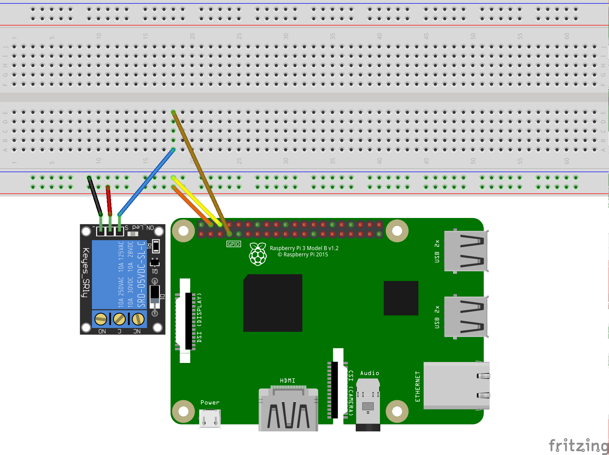

# Relay Module On/Off
Use [GPIO](https://developer.android.com/things/sdk/pio/gpio.html) on/off Relay Module.

##### Reference:
- [Android Things Tutorial（十）GPIO輸出 - 繼電器模組](http://www.codedata.com.tw/java/att10/)

